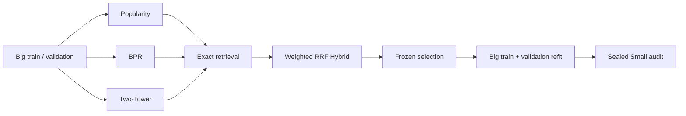

# Short-Video Retrieval on KuaiRec

## Project Summary

This repository is a leakage-aware, two-stage short-video retrieval study built
on [KuaiRec](https://github.com/chongminggao/KuaiRec). It compares:

- Global Popularity;
- BPR matrix factorization;
- a content-aware PyTorch Two-Tower;
- a frozen Two-Tower + BPR weighted reciprocal-rank fusion (RRF).

The project uses sparse Big Matrix interactions for fitting and model selection,
then performs a sealed audit on the nearly fully observed Small Matrix. It also
measures Exact and FAISS retrieval scalability without turning synthetic scale
extensions into recommendation-effectiveness claims.

The main result is deliberately mixed:

- on Big validation, Two-Tower improves Recall@100 over BPR by **48.76%** and
  retrieves items unseen during training through its content path;
- the frozen Hybrid improves Two-Tower NDCG@20 while retaining its Recall and
  coverage;
- on sealed Small, **BPR is strongest overall**;
- Two-Tower is strongest only on a descriptive slice of **88 Data-Cold
  targets**, which is too small for a significance claim;
- at the real 10K catalog size, sequential Exact retrieval is faster than the
  tested FAISS routes.

This is an offline MLE/recommender-systems project, not a production deployment.
It does not claim online A/B impact, statistical significance, or a universal
Two-Tower win.

## System Architecture



### Model paths

**BPR**

- 64-dimensional learned user/item factors;
- one resampled fit-observed negative per positive per epoch;
- excludes all fit-known positives for that user;
- scores an item unseen during fitting as zero.

**Two-Tower**

- item tower: item ID, category, frozen MiniLM caption vector, duration,
  dimensions, upload type and upload date;
- user tower: user ID plus a masked weighted mean of the last 50 causal history
  item representations;
- 128-dimensional L2-normalized outputs;
- temperature-scaled masked in-batch softmax;
- content-only fallback when an item's ID embedding was never trained.

**Hybrid**

- takes Two-Tower and BPR Top-500 results;
- combines ranks with weighted RRF;
- rank constant `60`, Two-Tower weight `alpha=0.75`;
- configuration frozen on Big validation before Small was opened.

The implementation includes deterministic data adapters, lazy training
examples, exact blocked matrix scoring, checkpoint identity validation,
content-only cold-item encoding and reproducible reports.

## Dataset and Leakage-Safe Protocol

KuaiRec provides:

- a sparse Big Matrix used for training and validation;
- a nearly fully observed Small Matrix used as a final static audit.

The official repository and
[CIKM 2022 paper](https://arxiv.org/abs/2202.10842) define the data design, but
not a mandatory Two-Tower model or metric recipe. This repository's executable
contract is documented in
[`docs/fully_observed_protocol_v1.md`](docs/fully_observed_protocol_v1.md).

### Label and history rules

- strong positive: strict `watch_ratio > 2.0`;
- a Two-Tower target must be the user's first interaction with that video;
- history events must be strictly earlier than the target timestamp;
- same-timestamp events cannot enter each other's histories;
- quick skips downweight history but are not explicit V1 negatives;
- daily engagement aggregates are forbidden model features.

### Big validation

- fit models only on canonical Big train;
- select checkpoints and Hybrid weight only on Big validation;
- use one query per user and train-only last-50 history;
- filter items already seen in train;
- rank the same fixed 9,365-item `NORMAL` catalog;
- report 6,816 warm-user queries and 118,539 warm targets;
- report the additional 2 cold-user queries and 26 targets separately.

### Sealed Small audit

After selection, each method is refit from scratch on Big train + validation.
For Small user `u`:

```text
candidates(u) = observed Small pairs intersect NORMAL items
relevant(u)   = candidates(u) where watch_ratio > 2.0
```

Missing Small pairs correspond to blocked/unavailable items and are not treated
as negatives. Small feedback is used only for candidate membership, relevance
and metrics. It never enters training, model features, user history, Popularity,
BPR, Two-Tower or Hybrid selection.

Data-Cold is relative to the active fit context:

- Big validation: no canonical interaction in Big train;
- sealed Small: no canonical interaction in Big train + validation.

The Small audit is nearly fully observed, but it is **not** a future-time test.
The separate temporal-final split remains unexecuted.

## Big Validation Results

All primary rows below share the same 6,816 warm-user queries, 118,539 targets,
9,365-item catalog, seen filtering and exact evaluator.

| Route | Recall@20 | Recall@50 | Recall@100 | NDCG@20 | Coverage@100 | Data-Cold Recall@100 |
|---|---:|---:|---:|---:|---:|---:|
| Global Popularity | — | — | 0.036643 | 0.010615 | 0.080085 | 0.000000 |
| BPR epoch 20 | 0.013891 | 0.030344 | 0.048439 | 0.012774 | 0.333049 | 0.000000 |
| Two-Tower epoch 1 | 0.014870 | 0.036038 | 0.072057 | 0.012113 | 0.569461 | 0.065151 |
| Hybrid `alpha=0.75` | 0.015643 | 0.037002 | **0.072213** | **0.015341** | **0.571169** | 0.060356 |

Observed findings:

- BPR Recall@100 is 32.2% higher than Global Popularity for the frozen
  single-seed protocol.
- Two-Tower Recall@100 is 48.76% higher than BPR and Coverage@100 increases
  from 0.3330 to 0.5695.
- Two-Tower Data-Cold Recall@100 is 0.0652 because unseen item IDs can fall
  back to category, caption and static content.
- Two-Tower's first-epoch NDCG@20 is slightly below BPR.
- the frozen Hybrid raises NDCG@20 by 26.65% relative to Two-Tower while
  preserving Recall@100 and coverage.

These are one-seed validation point estimates, not confidence intervals or
cross-dataset guarantees.

Detailed results:

- [BPR pilot](reports/phase_b1a/full_bpr_pilot.md)
- [Two-Tower training](reports/phase_b2b/full_two_tower_modal_l4.md)
- [Hybrid validation](reports/phase_b3a/hybrid_validation.md)

## Sealed Small Audit Results

Attempt 5 completed the frozen nearly-fully-observed audit:

- 1,411 evaluable users, all with Big history;
- 217,175 relevant targets;
- 4,676,570 observed `NORMAL` pairs;
- 3,327 candidate items;
- 88 Data-Cold targets.

| Route | Recall@20 | Recall@50 | Recall@100 | NDCG@20 | Coverage@100 | Data-Cold Recall@100 |
|---|---:|---:|---:|---:|---:|---:|
| Random | 0.005842 | 0.015039 | 0.030570 | 0.045656 | 1.000000 | 0.045455 |
| Global Popularity | 0.140601 | 0.212629 | 0.268417 | 0.514947 | 0.032161 | 0.000000 |
| **BPR epoch 20** | **0.173284** | **0.251986** | **0.319850** | **0.569454** | 0.403366 | 0.000000 |
| Two-Tower epoch 1 | 0.034061 | 0.058720 | 0.089741 | 0.159165 | 0.176135 | **0.295455** |
| Hybrid `alpha=0.75` | 0.039513 | 0.068028 | 0.103950 | 0.206173 | 0.178840 | 0.250000 |

The generalization result reverses the Big-validation story:

- BPR is strongest on overall Recall and NDCG;
- the frozen Hybrid improves on Two-Tower but remains far below BPR;
- Two-Tower is strongest only on the 88-target Data-Cold slice.

The Data-Cold result is descriptive because the denominator is small. No model,
checkpoint, feature, alpha or fallback was changed after Small was opened.
Earlier pre-metric/reporting failures and the successful audit are preserved in
the [sealed report](reports/phase_b3b/sealed_small_modal_l4.md).

## Retrieval Scalability Results

Phase B4A compares sequential single-query NumPy Exact, FAISS IndexFlatIP and
one frozen HNSW configuration using 256 fixed queries, 128-dimensional vectors,
Top-100 and 8 CPU threads.

| Scope | Items | Exact p50 | FlatIP p50 | HNSW p50 | HNSW Recall@100 |
|---|---:|---:|---:|---:|---:|
| real catalog | 10,725 | **0.071 ms** | 0.314 ms | 0.291 ms | 98.52% |
| synthetic extension | 100,000 | **0.420 ms** | 1.273 ms | 0.712 ms | 84.28% |
| synthetic extension | 1,000,000 | 9.665 ms | 13.370 ms | **3.902 ms** | 54.66% |

At the real 10K catalog, Exact is faster, so this project selects Exact
retrieval. At 1M, HNSW is faster but fails the frozen 99% quality gate with only
54.66% Recall@100 relative to FlatIP, so it is rejected.

These are sequential single-query measurements from one Modal environment.
QPS is derived from mean single-query latency, not concurrent serving
throughput. The 100K and 1M catalogs add deterministic normalized synthetic
distractors and make no recommendation-effectiveness claim.

See the complete [FAISS scalability report](reports/phase_b4a/faiss_scalability.md).

## Honest Findings and Limitations

- The sealed Small audit contradicts the validation ranking: BPR, not
  Two-Tower, is the strongest overall route.
- Small is nearly fully observed but is not temporal generalization.
- Temporal final has not been run.
- Big and Small metrics are single-seed point estimates without confidence
  intervals.
- The 88-target Data-Cold slice is too small for statistical claims.
- Synthetic 100K/1M distractors test retrieval systems, not recommendation
  quality or real catalog drift.
- B4A is one sequential single-query run on one Modal environment; it is not a
  concurrent service benchmark.
- No online A/B test, API, deployment, monitoring or production reliability
  claim is made.
- Frozen MiniLM caption vectors provide content features, but the language
  model is not fine-tuned end to end.
- The repository contains extensive provenance and failure records because the
  sealed audit was treated as irreversible; those details live in reports
  rather than the main project narrative.

The older protocol-v2.1.1 temporal work, its 97 baseline rows and ERRATUM-001
remain available in [`docs/legacy_protocol_v2.md`](docs/legacy_protocol_v2.md).
They are historical records, not the active fully-observed route.

## Reproduction

Python 3.11+ is required. Raw KuaiRec data and generated model artifacts are not
committed.

```bash
python3 -m venv .venv
.venv/bin/pip install -e '.[dev,training,benchmark]'
export KUAIREC_DATA_DIR=/path/to/KuaiRec/data
```

Run the test suite:

```bash
.venv/bin/pytest -q
python3 -m compileall src scripts tests
git diff --check
```

Verify the frozen protocol bundle:

```bash
.venv/bin/python scripts/audit_phase0.py --mode verify
```

The experiment runners intentionally require explicit data, processed-artifact,
caption-cache and checkpoint paths. Their frozen configurations are:

- [`configs/phase_b1a_bpr_pilot.yaml`](configs/phase_b1a_bpr_pilot.yaml)
- [`configs/phase_b2b_full_two_tower.yaml`](configs/phase_b2b_full_two_tower.yaml)
- [`configs/phase_b3b_final_recipe.yaml`](configs/phase_b3b_final_recipe.yaml)

The sealed Small runner additionally requires the explicit
`--execute-sealed-small` flag. Do not rerun it for model selection. Temporal
final remains guarded and is outside this project's reported results.

## Detailed Reports

| Stage | Report |
|---|---|
| Protocol | [Fully-observed V1](docs/fully_observed_protocol_v1.md) |
| Legacy temporal protocol | [Protocol-v2.1.1 history](docs/legacy_protocol_v2.md) |
| Phase 0 data audit | [Audit](reports/phase0/audit.md) |
| Legacy temporal baselines | [Validation](reports/phase1/validation_baselines.md) |
| Legacy segment correction | [ERRATUM-001](reports/phase1/ERRATUM-001.md) |
| BPR | [Full pilot](reports/phase_b1a/full_bpr_pilot.md) |
| Two-Tower | [Full L4 training](reports/phase_b2b/full_two_tower_modal_l4.md) |
| Hybrid | [Validation](reports/phase_b3a/hybrid_validation.md) |
| Final refit | [Report](reports/phase_b3b0/final_refit.md) |
| Sealed Small | [Attempt 5](reports/phase_b3b/sealed_small_modal_l4.md) |
| Retrieval scale | [Exact/FAISS benchmark](reports/phase_b4a/faiss_scalability.md) |

Machine-readable JSON accompanies each result report. Contracts, manifests and
failure records remain committed for auditability.
